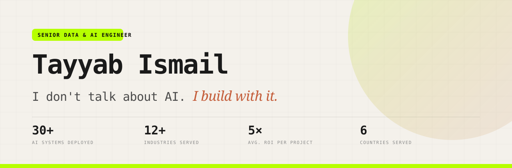

<div align="center">



<br /><br />

**[🌐 Live Site](https://tayyab-ismail-portfolio.pages.dev) · [💼 LinkedIn](https://www.linkedin.com/in/tayyab-i-509718270) · [📝 Blog](https://tayyab-ismail-portfolio.pages.dev/blog) · [📅 Book a Call](https://calendly.com/tayyabismail/30min)**

<br />


</div>

---

## 👋 Who I am

<table>
<tr>
<td width="36%" valign="top">

</td>
<td width="64%" valign="top">

I'm **Tayyab Ismail** — a Senior Data & AI Engineer who builds and ships production AI systems for businesses across the **US, UK, Germany, Australia, India, and Europe**.

I didn't arrive here through a computer science degree. I started in **biotechnology** and pivoted into AI the hard way: by building things, breaking them, and shipping them to real customers. That background is the whole point — I optimise for **business outcomes, not theoretical perfection**.

I work as a **solo operator**. The person who scopes your project is the person who architects it, writes it, and deploys it. No handoffs to juniors, no account managers, no black box.

```text
📍  Based in Pakistan · working with clients globally, remote-first
🚀  30+ AI systems deployed across 12+ industries
🧪  2.5+ years full-time in the AI trenches · 50+ tools tested
🎯  Healthcare · Legal · Real Estate · Dental · Home Services · SaaS
```

</td>
</tr>
</table>

---

## ⚡ What I do

I build AI that does actual work — not demos.

| | Service | What it means in practice |
|:--:|:--|:--|
| **01** | **AI / ML Solutions & Deployment** | Machine learning built on *your* data. Predictive models and intelligent automation — developed, tested, and deployed to production. |
| **02** | **AI Workflow Automation** | Kill the repetitive work. Emails, documents, approvals, CRM updates, and internal processes running around the clock without a human in the loop. |
| **03** | **AI Voice & Communication** | Voice agents that answer calls, qualify prospects, and book meetings, so you never lose a lead to a missed phone call. |
| **04** | **Customer Support Systems** | AI agents that answer from *your* knowledge base, route tickets, and cut support cost without wrecking the customer experience. |
| **05** | **Custom Software & AI Development** | Internal tools, customer-facing apps, RAG systems, API integrations — built around your workflow, not a template. |
| **06** | **AI Development & Consulting** | Getting your team productive with Claude Code, Cursor, Lovable, and Codex. Setup, workflow design, and training. |

> **The filter I apply to every project:** if it doesn't measurably save hours or make money, it doesn't get built.

---

## 🧰 Skill set

**AI & Machine Learning**


**Platforms & Models**


**Engineering**


**AI-Native Tooling**


---

## 🤝 Worked with

<div align="center">
&nbsp;&nbsp;&nbsp;&nbsp;
&nbsp;&nbsp;&nbsp;&nbsp;
&nbsp;&nbsp;&nbsp;&nbsp;
&nbsp;&nbsp;&nbsp;&nbsp;
&nbsp;&nbsp;&nbsp;&nbsp;
&nbsp;&nbsp;&nbsp;&nbsp;
&nbsp;&nbsp;&nbsp;&nbsp;

</div>

---

## 📖 What I write about

<table>
<tr>
<td width="33%" align="center">
<a href="https://tayyab-ismail-portfolio.pages.dev/blog/what-does-an-ai-consultant-actually-do"><br /><b>What Does an AI Consultant Actually Do?</b></a>
</td>
<td width="33%" align="center">
<a href="https://tayyab-ismail-portfolio.pages.dev/blog/machine-learning-for-small-businesses"><br /><b>Machine Learning for Small Businesses, Explained Simply</b></a>
</td>
<td width="33%" align="center">
<a href="https://tayyab-ismail-portfolio.pages.dev/blog/ai-chatbots-that-actually-solve-problems"><br /><b>AI Chatbots That Actually Solve Problems</b></a>
</td>
</tr>
<tr>
<td width="33%" align="center">
<a href="https://tayyab-ismail-portfolio.pages.dev/blog/reduce-support-costs-with-ai"><br /><b>How to Reduce Support Costs With AI</b></a>
</td>
<td width="33%" align="center">
<a href="https://tayyab-ismail-portfolio.pages.dev/blog/ai-readiness-assessment"><br /><b>The AI Readiness Assessment</b></a>
</td>
<td width="33%" align="center">
<a href="https://tayyab-ismail-portfolio.pages.dev/blog/when-you-actually-need-machine-learning"><br /><b>When You Actually Need Machine Learning</b></a>
</td>
</tr>
</table>

<div align="center"><a href="https://tayyab-ismail-portfolio.pages.dev/blog"><b>Read all articles →</b></a></div>

---

## 🏗️ About this repository

This is the source for my portfolio site — a hand-built, dependency-light React application. No page builder, no site generator, no vendor lock-in.

### Stack

| Layer | Choice | Why |
|:--|:--|:--|
| Build | **Vite 6** | Sub-second HMR, small production output |
| UI | **React 18** + **TypeScript** (strict) | Type-safe components, zero `any` |
| Styling | **Tailwind CSS v4** | CSS-first config via `@theme inline` — no `tailwind.config.js` |
| Routing | **React Router v6** | Client-side routing with scroll restoration |
| Motion | **Framer Motion** | Scroll-reveal and entrance animations |
| Icons | **Lucide** | Tree-shaken SVG icons |
| Hosting | **Cloudflare Pages** | Global edge CDN, automatic deploys on push |

### Features

- 🌓 **Dark mode** — system-preference aware, persisted to `localStorage`, with no flash of the wrong theme (inline bootstrap script in `index.html`)
- 🔎 **SEO / AEO / GEO optimised** — JSON-LD `Article` + `FAQPage` schema, question-form headings, and lead answer snippets so both Google *and* LLMs can cite the content
- 📝 **Full blog engine** — long-form articles with FAQ accordions, a reading-progress bar, and cross-linked related posts
- ⚡ **Fast** — 8.4 kB CSS / 136 kB JS gzipped, lazy-loaded imagery, immutable asset caching
- ♿ **Accessible** — semantic landmarks, visible focus states, 44px tap targets, honest `alt` text

### Project structure

```
├── public/
│   ├── assets/            # logos, portraits, article covers
│   ├── _headers           # Cloudflare cache + security headers
│   └── _redirects         # SPA fallback for client-side routes
├── src/
│   ├── components/        # Navbar, Footer, Reveal
│   ├── data/posts.ts      # blog article content + metadata
│   ├── hooks/             # useTheme, usePageMeta
│   ├── pages/             # Home, Services, About, Mentorship, Blog, BlogPost
│   ├── App.tsx            # routes + scroll restoration
│   └── index.css          # design tokens, custom utilities, keyframes
└── wrangler.toml          # Cloudflare Pages config
```

### Run it locally

```bash
npm install
npm run dev
```

Then open <http://localhost:5173>.

> On Windows you can double-click **`Start Website.bat`** — it starts the dev server and opens the browser for you.
>
> Opening `index.html` directly from the folder **will not work**: it's a Vite entry template, and ES modules plus client-side routing both require a server.

### Commands

| Command | Description |
|:--|:--|
| `npm run dev` | Start the dev server on port 5173 |
| `npm run build` | Type-check (`tsc -b`), then build to `dist/` |
| `npm run preview` | Serve the production build locally |

### Deployment

Every push to `main` triggers a Cloudflare Pages build:

| Setting | Value |
|:--|:--|
| Framework preset | `Vite` |
| Build command | `npm run build` |
| Build output directory | `dist` |
| Node version | `20` |

---

## 📬 Let's talk

If you're a founder, solopreneur, or marketer who wants AI doing real work in your business — not another chatbot demo — book a call. It's free, it's 30 minutes, and you'll leave with a clear answer on whether AI is worth it for your situation.

<div align="center">

### [📅 Book a Free AI Strategy Call →](https://calendly.com/tayyabismail/30min)

[](https://www.linkedin.com/in/tayyab-i-509718270)
[](https://www.instagram.com/tayyabismail.ai)
[](https://www.facebook.com/share/14gmS5ft4Gd/?mibextid=wwXIfr)
[](https://tayyab-ismail-portfolio.pages.dev)

</div>

---

<div align="center">
<sub>Built with AI. Shipped with intent. · © 2026 Tayyab Ismail</sub>
</div>
